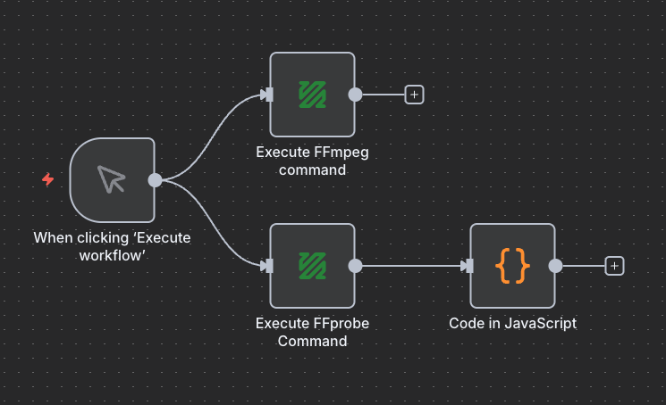

# 🎬 n8n-nodes-ffmpeg-command

[](https://n8n.io/) [](https://www.npmjs.com/package/n8n-nodes-ffmpeg-command)

A N8N node for executing FFmpeg and FFprobe commands - no need for binary installations or custom Docker images.

## ✨ Features

- 🎥 **FFmpeg Command Execution**: Run any FFmpeg command to process video, audio, and multimedia files
- 🔍 **FFprobe Media Analysis**: Extract detailed information about media files using FFprobe
- 📦 **Zero Installation**: Uses static binaries - no external FFmpeg/FFprobe installation required
- ⚙️ **Full Command Support**: Execute complex FFmpeg/FFprobe commands with custom parameters
- 🛡️ **Error Handling**: Robust error handling with continue-on-fail options
- 🔧 **Workflow Integration**: Seamlessly integrates into n8n workflows as input nodes


## 📸 Examples


## 📦 Installation

### Community Node

1. Go to **Settings > Community Nodes** in n8n
2. Search for `n8n-nodes-ffmpeg-command`
3. Click **Install**

### Manual Installation

1. Install the package:
   ```bash
   npm install n8n-nodes-ffmpeg-command
   ```

2. Restart n8n

## 🚀 Usage

### FFmpeg Command Node

1. Add the **FFmpeg command** node to your workflow
2. Configure the required parameter:
   - **Command**: Your FFmpeg command (must start with `ffmpeg`)

#### Example Commands

```bash
# Convert video format
ffmpeg -i input.mp4 output.avi

# Extract audio from video
ffmpeg -i input.mp4 -vn output.mp3

# Resize video
ffmpeg -i input.mp4 -vf scale=640:480 output.mp4

# Add watermark
ffmpeg -i input.mp4 -i watermark.png -filter_complex "overlay=10:10" output.mp4
```

### FFprobe Command Node

1. Add the **FFprobe command** node to your workflow
2. Configure the required parameter:
   - **Command**: Your FFprobe command (must start with `ffprobe`)

#### Example Commands

```bash
# Get basic file information
ffprobe -v quiet -print_format json -show_format -show_streams input.mp4

# Get duration only
ffprobe -v quiet -show_entries format=duration -of default=noprint_wrappers=1:nokey=1 input.mp4

# Get video resolution
ffprobe -v quiet -select_streams v:0 -show_entries stream=width,height -of csv=s=x:p=0 input.mp4
```

### Node Properties

#### FFmpeg Command Node
- **Command**: FFmpeg command string (required, must start with `ffmpeg`)

#### FFprobe Command Node
- **Command**: FFprobe command string (required, must start with `ffprobe`)

## 🛡️ Error Handling

The nodes include comprehensive error handling:

- **Continue on Fail**: When enabled, failed commands won't stop the workflow
- **Detailed Error Messages**: Clear error descriptions for troubleshooting
- **Item Index Tracking**: Errors include item index for multi-item workflows

## ⚡ Performance Considerations

- **Command Validation**: Commands are validated to ensure they start with the correct binary name
- **Static Binaries**: Uses pre-compiled static binaries for maximum compatibility
- **Async Execution**: Commands execute asynchronously without blocking the workflow

## 🕵️‍♂️ Troubleshooting

**Node doesn't appear in n8n:**
- Ensure the package is properly installed
- Restart n8n after installation
- Check console for loading errors

**Command fails:**
- Verify the command syntax is correct
- Ensure input files exist and are accessible
- Check file paths are absolute or relative to the working directory
- Review FFmpeg/FFprobe documentation for command options

**Binary not found errors:**
- The static binaries should be included automatically
- If issues persist, check the node logs for binary path information

**Slow execution:**
- Complex commands may take time depending on file size and operations
- Monitor system resources during execution

## 🛠️ Development

### Building from Source

```bash
git clone https://github.com/revolabs-io/n8n-nodes-ffmpeg-command.git
cd n8n-nodes-ffmpeg-command
npm install
npm run build
```

### Testing

```bash
npm run dev
```

This starts n8n with the nodes loaded for testing.

## 📋 Changelog

See [CHANGELOG.md](CHANGELOG.md) for a complete history of changes and releases.

## 🤝 Contributing

We welcome contributions! Please see our [Contributing Guide](CONTRIBUTING.md) for details.

### Development Setup

1. Fork the repository
2. Create a feature branch: `git checkout -b feature/amazing-feature`
3. Make your changes and add tests
4. Run tests: `npm test`
5. Commit your changes: `git commit -m 'Add amazing feature'`
6. Push to the branch: `git push origin feature/amazing-feature`
7. Open a Pull Request

## 📝 License

This project is licensed under the MIT License - see the [LICENSE](LICENSE) file for details.

## 🙏 Acknowledgments

- [FFmpeg](https://ffmpeg.org/) - A complete, cross-platform solution to record, convert and stream audio and video
- [FFprobe](https://ffmpeg.org/ffprobe.html) - FFmpeg's multimedia analyzer
- [ffmpeg-static](https://github.com/eugeneware/ffmpeg-static) - Static binaries for FFmpeg
- [ffprobe-static](https://github.com/joshwnj/ffprobe-static) - Static binaries for FFprobe